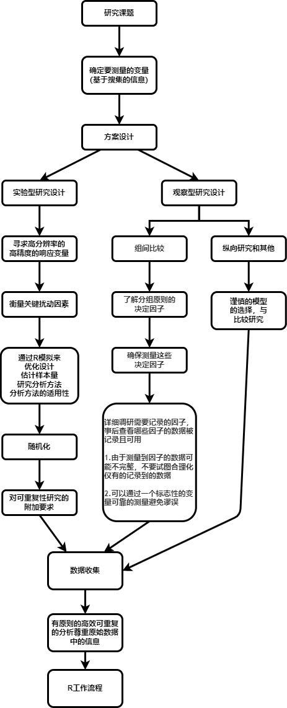
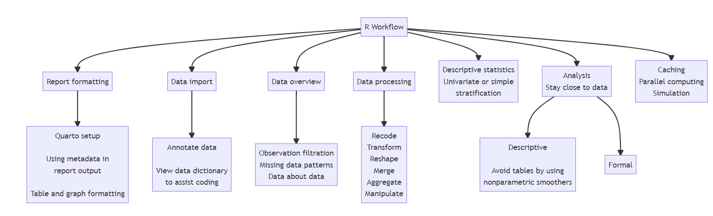

[Frank Harrell](https://www.fharrell.com/)
生物统计学教授和统计学家,业界大佬。

>现将可重复性研究的工作流程引荐性文章做中文翻译，感谢他无私的知识分享。翻译大量采用自动机翻，如果在翻译过程中产生误解，那一定是我的能力不足，欢迎指正批评。

[英文原文](https://www.fharrell.com/post/rflow)

中文翻译如下：

本文是对[R Workflow电子书](https://hbiostat.org/rflow/)的概述，该书还包含R入门知识和许多带有代码、输出和图形的例子，其中许多图形是互动的。在这里，我概述了分析项目的工作流程，我发现在使用R与Rmarkdown和Quarto制作可重复的研究报告时，这些流程是有效的。我首先介绍了导入数据、创建注释的分析文件、检查缺失数据和数据的维度，并对其运行描述性统计，目的是了解数据及其质量和完整性。Hmisc包中的函数被用来给数据框架和数据表（ data frames and data tables ）加上标签和测量单位的注释，显示元数据/数据字典（metadata/data dictionaries），并产生表格和图形的统计摘要。给出了高效和清晰的变量重新编码的方法。给出了几个使用data.table包处理和操作数据的例子，包括一些非琐碎的纵向数据计算。简要介绍了数据分析的一般原则，并介绍了一些灵活的二元变量和三元变量的分析方法，强调要贴近数据，同时要规避对连续型独立变量（continuous independent variables）进行分类的问题。（原文while avoiding highly problematic categorization of continuous independent variables）。电子书（指代[R Workflow](https://hbiostat.org/rflow/)）中介绍了将观察值排除在分析之外的流程图、缓存结果、并行处理和模拟等例子。在这个过程中，举例说明了几种有用的报告编写方法，包括由程序控制的多个报告标签的创建。

Joseph Rickert在此对[R Workflow](https://hbiostat.org/rflow/)进行了审阅。至于初学者入门R的想法，可参阅[Norm Matloff的文章:学习R的许多有用的想法](https://github.com/matloff/TidyverseSkeptic)。

## 1 分析工具

做现代的、高质量的、可重复的分析的关键工具是用于数据导入、处理、分析、表格和图形的R，以及用于制作高质量静态和交互式报告的Quarto。R Markdown的用户会发现很容易在语法上做一些小的改变来转换为Quarto。Quarto和R Markdown都依靠R knitr包来处理混合的句子和代码，将代码的表格和图形输出插入报告中。

## 2 研究过程

下图是对研究过程的一个过于简化的总结

在这个过程中，R和Quarto在几个点上发挥了关键作用。

## 3 R工作流程

在hbiostat.org/rflow上详细介绍的R工作流程有许多组件，如下图所示。
图片翻译（略过。水平有限，发现有些名词、句子翻译后更难理解了。）

Quarto、data.table、Hmisc和ggplot2软件包为上述流程提供了强有力的支持和便利。data.table对R工作流程十分重要。data.table提供了一个统一的、清晰的、简洁的、有凝聚力的语法，用于以大量的方式操作数据。而且，它没有任何依赖性，这使得软件更新在长期项目中更容易管理。[R Workflow](https://hbiostat.org/rflow/)一书涵盖了最常用的数据处理操作，有许多使用data.table的例子。

R Workflow还广泛使用了Github资源库中的[reptools](https://github.com/harrelfe/rscripts/blob/master/reptools.r)，其中包含了书中例举的一些功能。

## 4 格式化报告

报告格式化可以细分为多个领域。

- 格式化句子，包括数学符号，制作着重符号和编号列表，以及交叉引用
- 格式化表格和图形输出
- 使用元数据（即变量标签和测量单位）来增强各种输出
- 使用Quarto功能来扩展格式，例如，使用可折叠的部分、有标签的部分、边注、以及图表大小和说明

## 5 初始化工作流程

初始化工作流程主要步骤是

- 从其他系统导入csv文件或二进制文件
- 改进变量名称
- 用标签和单位对变量进行注释
- 查看数据字典（data dictionaries）
- 记录

拥有一个浏览器或RStudio窗口来查看数据字典（data dictionaries），特别是查询变量名称和分类值，对编程有很大帮助。R工作流还展示了如何一步到位地导入和处理大量的数据集，而无需重复编程，以及如何从外部来源导入元数据。

为了方便和清晰地进行编程，强烈建议变量标签要清晰，不要太长，并建议用变量标签来提供完整的描述。变量标签可以在分析过程中的任何时候以编程方式查询，以便纳入表格和坐标轴中。

## 6 缺失数据

缺失数据是分析的一个主要挑战。了解并记录缺失的程度和模式是很重要的。Hmisc包和reptools资源库提供了对缺失性的全面观察，包括哪些变量在同一主体上倾向于缺失。总结缺失数据模式的多种方式最好以多个标签的形式报告。reptools资源库可以很容易地以编程方式创建标签，这在书中举例的reptools missChk函数中得到了应用。 missChk拟合了一个序数逻辑回归模型来描述哪些类型的被试（基于没有NA的变量）倾向于有更多的变量缺失。

## 7 数据检查

穗状直方图（Spike histograms ）通常提供了检查连续变量有效性的最佳单一方法。reptools的dataChk函数允许用户通过提供一系列R表达式，针对数据表运行，轻松检查范围和跨变量的一致性。dataChk在标签中总结结果，每个检查有一个标签，此外还包括两个总体总结标签。

## 8 数据概述

了解分析样本是如何形成的是很有价值的。由于研究的纳入/排除标准和由于数据缺失而对观察结果进行过滤，通常用Consort图来记录。Consort包可以使用R数据元素将分母插入到图的节点中，从而很容易产生这种图。另外，R/knitr/Quarto的组合以及mermaid自然图示语言可以用来制作由数据填充的consort-like流程图，以及其他许多类型的图示。

另一种类型的数据概述是基于计算每个变量的各种度量。这些指标包括

- 不同值的数量
- NA的数量
- 一种信息度量，对于数字变量来说，它将变量中的信息与没有纽带的完全连续变量中的信息进行比较。
- 变量分布的不对称程度
- 变量模态值（最频繁的值）。
- 模态值的频率
- 最小频率值
- 该值的频率

reptools dataOverview函数计算了所有这些指标，并将其中一些指标绘制在散点图上，悬停的文字将显示该点所代表的变量的详细信息。

## 9 描述性统计

对于一个连续变量来说，最好的描述性统计是具有100或200个bin的尖峰直方图。这将揭示出双峰性、数字偏好、离群点和许多其他数据特征。R工作流程中没有涉及的经验累积分布，也是很好的全信息总结。下一个最好的总结是显示平均值和多个量级的扩展箱形图。R工作流程中涵盖了扩展箱形图的细节和例子。

表格可以总结分类变量的频率分布，以及连续变量的中心趋势度量、选定的量值和传播度量。当有一个真正离散的基线变量时，我们可以对其进行分层，并计算上述类型的汇总措施。当人们试图在将连续基线变量分组为区间后对其进行分层时，表格完全失败。这是因为对连续变量进行分类是个坏主意。

在其他问题中

- 分类法错过了发生在区间内的关系（当区间很宽时，如外四分位数，这种情况最常发生）
- 由于忽视了区间内结果的异质性，也没有利用区间的排序，所以分类法失去了信息和统计能力
- 区间是任意的，改变区间的边界会大大改变表面的关系
- 有了切点（cutpoints），人们就可以很容易地操纵结果；人们可以找到一组产生正向关系的切点和一组产生负向关系的不同切点

因此，在描述一个变量与一个连续变量的关系时，表格并不是很好的工具。为此，需要非参数平滑器或灵活的参数模型。当因变量Y是二进制或连续的，loess非参数平滑器是一个很好的默认选择。对于二进制Y，loess估计Y=1的概率。对于连续的Y，loess估计Y的平均值是X的函数。例如，我们可能想估计胆固醇的中位数作为年龄的函数，胆固醇的四分位数范围作为年龄的函数，或者当存在删减时，1年和2年的疾病发生率与连续风险因素的关系。获得对连续X的平滑估计的一种通用方法是通过移动统计总结。移动平均数是最古老的例子。通过移动统计，人们在一个小窗口（比如说观察值）内计算任何感兴趣的统计（平均值、四分位数、SD、Kaplan-Meier估计值），然后将窗口向上移动几个（比如说1-5个）观察值并重复这一过程。对于每个窗口，代表该窗口的X值是该窗口内的平均X值。然后用黄土或 "超级平滑器 "对移动估计值进行平滑处理。所有这些都可以通过reptools movStats函数轻松实现，R工作流程中给出了几个例子。

在随机临床试验中，通常会出现 "表1"，其中的描述性统计数字是按分配的治疗方法分层的。由于特征的不平衡在定义上几乎是偶然的不平衡，表1会产生反作用。为什么不提出一些可能揭示出有意义的意外结果呢？这很容易做到，用一个多面板图代替表1，显示每个基线变量与临床试验主要结果变量的关系。R工作流程中介绍了一些例子。这些例子包括用尖峰直方图和扩展箱形图来增强趋势图，以显示基线变量的边际分布。

## 9.1 纵向数据
R工作流提供了几个纵向数据的图形描述的例子。

- 用于连续Y的代表性曲线
- 用于纵向顺序数据的三种类型的图表
   1. 多事件图表
   2. 所有时间段的状态转换比例
   3. 所有时间段的状态占用比例和不同治疗的比例
- 用于连续时间-事件数据的事件图

虽然通常不是纵向的，但用于比较临床试验中安全状况的不良事件图表，使用包括比例差异的置信区间的点图。

## 10 数据操作和聚合
R工作流有很多例子，包括以下内容

使用data.table
- 对数据表（或数据框架）进行子集，并对子集进行分析
- 计算观测值
- 按一个或多个分层变量运行单独的分析或只是计算描述性统计数字
- 添加和改变变量
- 根据变量名称中的模式选择变量
- 删除变量
- 以多种方式重新编码变量
- 表格查询
- 自动运行所有可能的边际总结（例如，小计）。
- 合并数据表
- 重塑数据表（例如，从宽到高和薄）。
- 灵活处理受试者的纵向数据，包括 "重叠连接 "和 "非等价 "连接

## 11 图形
ggplot2和plotly在图形报告中起着关键作用。给出了几个例子，并给出了从数据字典中提取数据以更好地注释图形的方法（例如，将变量标签放在坐标轴上，加上较小字体的测量单位）。这允许人们为任何样本大小创建散点图，以一种容易理解的方式处理重合点。

## 12 分析
分析应该由统计学原理驱动，并尽可能地以统计分析计划为基础，以避免双重浸透和过多的 "调查者自由度"，即所谓的分叉路径花园。分析应该是完全可重复的。他们应该尽可能地使用原始数据，决不能将连续变量或序数变量二分化。不要落入平行组研究中计算基线变化的陷阱。

一个例外是：一个水平不高的序数预测因子可以作为分类变量来建模，但要使用所有可能的二分法（少一个）的指示变量。

## 12.1 描述性分析
当基线变量是真正的分类变量时，这可能涉及简单的分层估计，而且不需要对其他变量进行调整。一般来说，基于模型的方法更好，因为它可以调整任何数量的其他变量，同时仍然提供描述性结果。

为了尊重连续变量的性质，描述性分析可以使用上面概述的一般 "重叠窗口中的移动统计 "方法，或者如果平均值只是感兴趣的话，可以使用loess。

认识到通常的表1没有有用的信息，而选择有用的结果趋势。

不要犯错误，把自变量和因变量的角色互换一下。医学文献中的许多论文展示了一个描述性统计表，其中有两栏：有事件的病人和没有事件的病人。这种表述方式不仅忽略了事件发生的时间，而且还将结果作为唯一的自变量。相反，显示预测结果的非参数趋势，而不是用结果来预测基线变量。R工作流有很多这样的例子。

## 12.2 形式化分析

一般推荐使用贝叶斯方法，但无论使用频繁主义、贝叶斯还是似然主义方法，都应该使用最佳统计实践，详见[《回归建模策略》](https://hbiostat.org/rms/)和[《生物医学研究的生物统计学》BBR](https://hbiostat.org/bbr/)。

不确定性区间（UI），如相容区间、置信区间、贝叶斯可信区间和贝叶斯最高后验密度区间，是理解诸如治疗等变量效应的重要工具。在随机临床试验（RCTs）中，一个极其常见的错误，也是NEJM等杂志的不良统计政策所迫使的，就是在平行组研究中计算单一治疗臂的结果倾向的UI。由于RCTs不是从病人群体中取样，而是依靠方便取样，因此人们无法从单组UI中得出有用的推论。RCTs之所以有趣，是因为病人入院后发生的事情：研究者控制的随机治疗。唯一相关的UI是关于结果的差异。

当用户界面近似对称时，人们可以通过使用 "半数置信区间 "将用户界面与治疗特定的点估计值放在同一图表上。在频繁主义领域，这些区间具有这样的属性：当且仅当平等的统计检验在某一统计水平上未被拒绝时，点估计才会触及区间。R工作流有许多例子，显示了这种方法在比较两条生存曲线时的特殊价值。

## 13 缓存和并行计算
R Markdown和Quarto使用的knitr提供了一个自动缓存系统，以避免在对一个报告只做表面改动时不得不运行耗时的步骤。但人们往往希望在当前步骤中控制缓存过程以及对软件和数据的依赖性进行核算。runifChanged函数使之变得简单。另一个节省时间的方法是在你的机器上使用多个处理器。R工作流展示了缓存和并行计算的简单例子。

## 14 仿真
模拟有很多用途，包括对研究设计的贝叶斯主义和频繁主义力量的估计，尝试不同的设计以找到一个最佳设计，以及评估统计分析程序的性能。为了减少编码和提高计算效率，当有许多参数/条件的组合需要研究时，可以使用多维数组。例如，如果要改变样本量、协变量的数量、Y的方差和要检测的治疗效果，可以建立一个四维数组，运行四个嵌套的for语句，并将结果塞入数组的适当元素。对于图表结果（例如使用ggplot2点阵图），很容易将4维数组串成一个高而薄的数据集，每个维度都有一个变量。R工作流提供了一个完整的例子，以及另一种使用数据表而不是数组的方法。

**视听拓展**

Resource that is related to Frank Harrell:

1. [LBS#45 Biostats & Clinical Trial Design, with Frank Harrell](https://learnbayesstats.com/episode/45-biostats-clinical-trial-design-frank-harrell/)

2. [R Workflow电子书](https://hbiostat.org/rflow/)

3. 翻译辅助软件[DeepL](https://www.deepl.com/translator)

4. [Norm Matloff的文章:学习R的许多有用的想法](https://github.com/matloff/TidyverseSkeptic)