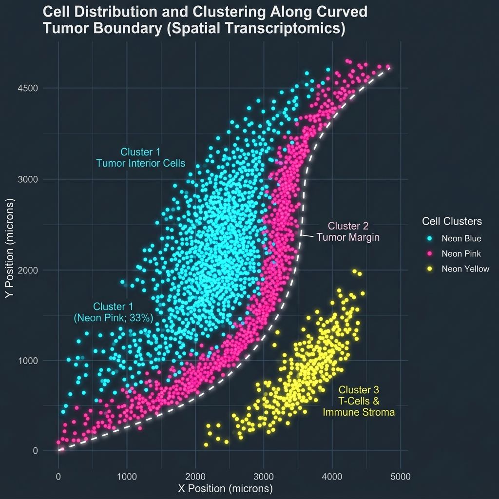

随着空间转录组学（Spatial Transcriptomics）和多重荧光免疫组化（mIF）的快速发展，我们的病理分析已经跨越了“组织级别”，迈入了**单细胞级别**的“空间地理学”研究。

当我们利用 Cellpose 或 ImageJ 将一张高分辨率的病理切片分割成成千上万个独立的细胞并分类后，我们最终能获得一份结构化的数据表：包含每个细胞的唯一的 `Cell ID`、物理空间二维坐标 `(X, Y)` 以及其表型标签（如肿瘤细胞、T 细胞、巨噬细胞）。

本篇文章将介绍如何使用 R 语言对这类空间坐标数据进行深度的定量与可视化分析。

---

## 1. 空间点格局与细胞地理分布

在病理图像分析中，每个细胞的二维坐标可以被抽象为数学上的 **“空间点格局”（Spatial Point Pattern）**。R 语言中的 `spatstat` 软件包是研究该问题的黄金工具。

我们可以通过散点图来直观展现细胞在切片上的微环境聚类情况。下图是利用 R 语言中 `ggplot2` 对肿瘤浸润边界免疫细胞分布的拟合可视化效果：



图中点代表单个细胞，虚线即为我们使用拟合算法识别出的**肿瘤边缘浸润线（Tumor Margin）**。

---

## 2. 空间特征建模的三大核心计算

要定量分析肿瘤微环境中的免疫浸润状态，我们通常会计算以下三个空间指标：

| 定量指标 | 常用数学方法 | 在病理学中的生物学意义 |
|:---|:---|:---|
| **免疫细胞局部密度** | 核密度估计 (KDE, Kernel Density) | 识别组织切片中免疫细胞聚集的热区 (Hot spots) |
| **空间邻近度分析** | 最近邻距离 (Nearest Neighbor Distance) | 计算毒性 T 细胞距离最近的肿瘤细胞的平均距离 |
| **边界浸润深度** | 欧氏距离投影 / 泰森多边形 (Voronoi) | 评估免疫细胞突破肿瘤基质屏障进入肿瘤核心的能力 |

---

## 3. R 语言核心分析代码示例

以下是利用 R 语言对细胞物理坐标数据进行最近邻距离计算与可视化的简要代码：

```r
library(tidyverse)
library(spatstat)

# 1. 载入分割后的单细胞数据
cell_data <- read_csv("single_cell_coordinates.csv") # 含有 x, y, cell_type 列

# 2. 将数据转换为 spatstat 的 ppp 点模式对象
# 设定切片物理边界 window (微米)
window_obs <- owin(c(0, 5000), c(0, 5000))
cell_ppp <- ppp(x = cell_data$x, y = cell_data$y, 
                window = window_obs, 
                marks = as.factor(cell_data$cell_type))

# 3. 计算所有“CD8+ T细胞”到最近的“Tumor细胞”的欧氏距离
t_cells <- cell_ppp[marks(cell_ppp) == "CD8+ T-Cell"]
tumor_cells <- cell_ppp[marks(cell_ppp) == "Tumor-Cell"]

# 使用 nncross 计算交叉最近邻
nn_dist <- nncross(t_cells, tumor_cells)

# 4. 合并结果进行可视化
t_cells_df <- as.data.frame(t_cells) %>%
  mutate(dist_to_tumor = nn_dist$dist)

# 使用 ggplot2 绘制距离分布图
ggplot(t_cells_df, aes(x = dist_to_tumor)) +
  geom_density(fill = "#00b4d8", alpha = 0.6) +
  theme_minimal() +
  labs(title = "CD8+ T-Cell Distance to Nearest Tumor Edge",
       x = "Distance (microns)", y = "Density")
```

---

> [!TIP]
> **坐标清洗建议**：在从图像分析软件（如 QuPath）导出坐标时，请务必确认导出的是**物理微米坐标（Microns）**而不是**像素坐标（Pixels）**。不同成像分辨率（如 20x 与 40x）下的像素物理意义不同，直接使用像素坐标会导致跨批次实验的空间分析结果无法直接对比。

> [!NOTE]
> **边缘效应（Edge Effects）**：当计算靠近组织边界的细胞时，容易因为视野截断导致“最近的邻居在视野外”而产生误差。在 spatstat 中进行密度估计时，建议开启 `edge = TRUE` 边缘校正选项。

## 4. 总结与展望

通过将 R 语言强大的统计计算和绘图能力引入病理切片分析，我们可以把静态的图像转换成动态的空间特征矩阵。这对于评估肿瘤免疫微环境分型、发掘新型空间生物标志物（Spatial Biomarkers）以及指导癌症的精准免疫治疗具有重大的科研应用价值。
