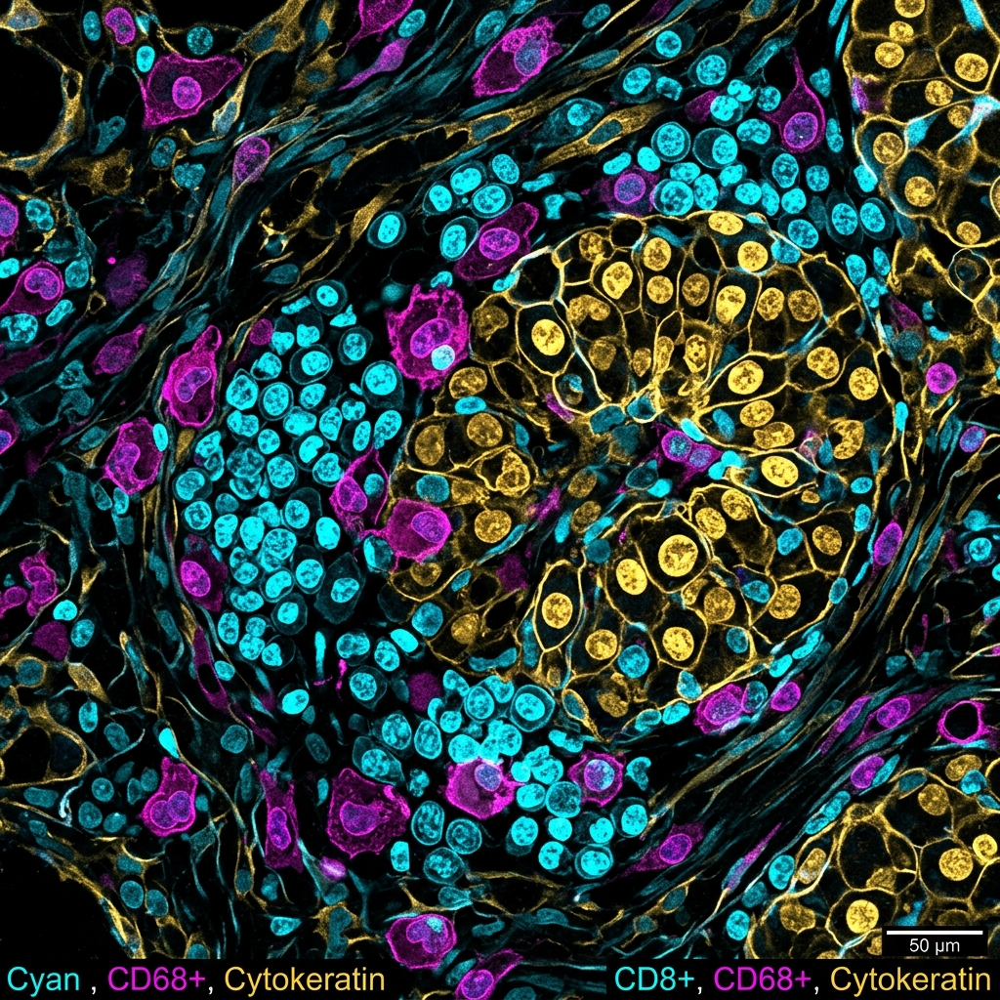

In translational oncology, understanding *where* immune cells are located relative to tumor boundaries is just as critical as knowing *how many* immune cells exist. Traditional bulk sequencing merges these spatial nuances, leaving us blind to key geographical layouts. 

Multiplex Immunofluorescence (mIF) solves this by allowing researchers to stain and visualize multiple biomarkers simultaneously on a single formalin-fixed paraffin-embedded (FFPE) tissue section.

---

## 1. Decoding Spatial Biology

Using mIF, we can map complex cellular phenotypes in the tumor microenvironment (TME). For instance, we can identify whether T-cells are actively infiltrating the tumor nest or if they are excluded and held back at the stromal margins.

Below is an illustrative confocal microscopy image demonstrating multi-channel staining in a liver cancer microenvironment:



This image maps cytokeratin (tumor epithelial cells) alongside immune infiltration markers including CD8+ T-cells and CD68+ macrophages.

---

## 2. Fluorescent Marker Configurations

A standard multiplex panel for tumor immune profiling maps markers across different spectral channels. Here is a typical marker matrix:

| Channel | Marker | Target Cell Type | Functional Meaning in TME |
|:---|:---|:---|:---|
| **UV (DAPI)** | Nuclei | All Cells | Maps physical cell density and tissue structure |
| **Cyan** | CD8+ | Cytotoxic T-cells | Identifies active tumor-killing cells |
| **Magenta** | CD68+ | Macrophages | Highlights immunosuppressive or phagocytic zones |
| **Gold** | Cytokeratin | Epithelial/Tumor cells | Delineates the tumor nest boundary |

---

## 3. The Digital Workflow: Segmentation & Analysis

Once high-resolution multi-channel images are acquired, computational tools are used to segment the cells. This allows us to quantify spatial metrics such as:
1. **Nearest-Neighbor Distance**: The exact distance (in micrometers) between tumor cells and CD8+ cytotoxic cells.
2. **Infiltration Depth**: How deep immune cells have traveled past the cytokeratin-positive margin.

For example, we can parse and filter morphometric output tables in R:

```r
library(tidyverse)

# Compute average distance from CD8+ cells to nearest tumor boundary
spatial_data %>%
  filter(cell_type == "CD8+ T-Cell") %>%
  group_by(sample_id) %>%
  summarize(
    avg_distance_um = mean(dist_to_tumor_edge),
    infiltrated = sum(dist_to_tumor_edge < 0) / n()
  )
```

> [!NOTE]
> **Spatial Context is Key**: Simply measuring the bulk abundance of immune cells is insufficient. Two tumors can have the exact same number of T-cells, but if one has them trapped in the stroma while the other has them infiltrating the core, the patient outcomes will be drastically different.

## 4. Outlook: CRISPR Target Screen Integration

By combining multiplex imaging with CRISPR-Cas editing screens, we can knock down target genes in tumor cells and observe directly how the local spatial architecture changes. For example, knocking down chemokine selectors can abolish T-cell homing, which becomes instantly visible under the confocal microscope.

By leveraging these visual datasets, we continue to bridge the gap between microscopic cellular behavior and clinical predictions.
